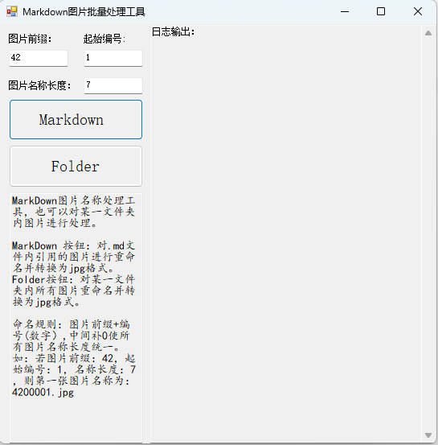

# Markdown图片批量处理工具

本项目是一个基于 Windows Forms 的图片批量处理工具，支持对 Markdown 文件中引用的图片或文件夹内的图片进行重命名和格式转换。

## 功能简介

- **Markdown 文件处理**：批量处理选定 Markdown 文件中引用的图片，将图片重命名为统一格式并转换为 JPG 格式，同时自动更新 Markdown 文件中的图片路径。
- **文件夹图片处理**：批量处理指定文件夹内的所有图片，将其重命名为统一格式并转换为 JPG 格式。

## 命名规则

图片名称格式为：`图片前缀 + 补零 + 编号.jpg`  
例如：前缀为 `42`，起始编号为 `1`，名称长度为 `7`，则第一张图片命名为 `4200001.jpg`。

## 使用方法

1. **编译与运行**
   - 使用 Visual Studio 2022 打开本项目，编译并运行。

2. **设置参数**
   - 图片前缀：设置图片名称的前缀。
   - 起始编号：设置图片编号的起始值。
   - 图片名称长度：设置图片名称的总长度（包括前缀和编号，不足部分自动补零）。

3. **处理 Markdown 文件**
   - 点击 `Markdown` 按钮，选择一个或多个 `.md` 文件，程序会自动处理文件中引用的图片。

4. **处理文件夹图片**
   - 点击 `Folder` 按钮，选择目标文件夹，程序会自动处理该文件夹下所有图片。

5. **查看日志**
   - 右侧日志框会显示处理进度和结果。

## 支持的图片格式

- PNG
- JPG/JPEG
- GIF
- BMP

## 环境要求

- .NET Framework 4.8
- Visual Studio 2022
- Windows 7 及以上

## 注意事项

- 处理过程中，原图片会被删除，请提前备份重要文件。
- 仅支持本地图片路径，不支持网络图片。

---

_如有问题或建议，欢迎反馈！_
